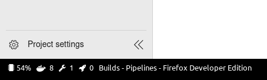

# DevOpsTools

While this is still a work in progress I already do use this tool on my Linux setup to get insights in builds and deployments. I wrote a small shell script to include numbers in my polybar:



This means: currently one active builds, zero running deployments (and 8 active docker containers).

The shell script (nothing fancy, should test if amount is a number to prevent errors):

```bash
#!/usr/bin/env bash
amount=$(dotnet /home/jacob/.config/polybar/modules/polybar-devops-builds/DevOpsTools.CLI.dll $@ -o AmountOnly)
echo $amount
```

For those interested in my polybar config:
```
[module/devopsbuilds]
type = custom/script
exec = ~/.config/polybar/modules/polybar-devops-builds/polybar-devops.sh builds
interval = 30 
format-prefix = "  "
format-foreground = ${colors.foreground}
format-background = ${colors.background}
format-padding = 0

[module/devopsdeployments]
type = custom/script
exec = ~/.config/polybar/modules/polybar-devops-builds/polybar-devops.sh deployments
interval = 30 
format-prefix = "  "
format-foreground = ${colors.foreground}
format-background = ${colors.background}
format-padding = 0

```

## Getting started

1. Create an appsettings.json file like this in the root folder:

```json
{
  "DevOpsSettings":
  {
    "BaseAddress": "https://somedevsopsurl/",
    "PersonalAccessToken": "your devops personal access token here",
    "CurrentProject": "The project you want to retreive information from",
    "Top": 10
  }
}
```
## Todo

- Add more features
- Make it a .net global tool
- Add better way of configuring, more projects

## Links

- Inspired by and used some code from [AnyStatus](https://github.com/AnyStatus/AzureDevOps).
- Used [this](https://github.com/garoyeri/sample-console-app-net-core-01) repository as an inspiration for the console application.